# Language Learn App — 単語帳アプリ

日本語話者向けの英語学習単語帳アプリです。  
AI（Claude または Gemini）が意味・発音・例文を自動生成し、スマートな単語テストで効率よく覚えられます。

## リポジトリ構成

| ディレクトリ | 内容 |
|---|---|
| [`server_app/`](server_app/) | Python (FastAPI + HTMX) Web アプリ |
| [`smartphone_app/`](smartphone_app/) | Flutter スマートフォンアプリ |

スマートフォンアプリの実行方法は **[smartphone_app/README.md](smartphone_app/README.md)** を参照してください。

---

## 目次（Web アプリ）

1. [セットアップ](#セットアップ)
   - [Gemini API キーの取得](#google-gemini-api-キーの取得手順無料クレジットカード不要)
2. [ダッシュボード](#1-ダッシュボード)
3. [単語を追加する](#2-単語を追加する)
4. [単語帳を見る](#3-単語帳を見る)
5. [単語テストを受ける](#4-単語テストを受ける)
6. [実績を確認する](#5-実績を確認する)
7. [エクスポート／インポート](#6-エクスポートインポート)
8. [ディレクトリ構成](#ディレクトリ構成)
9. [技術スタック](#技術スタック)

---

## セットアップ

### 必要条件

- Python 3.12+
- [uv](https://docs.astral.sh/uv/) パッケージマネージャー
- AI API キー（Claude **または** Gemini のどちらか一方）

| プロバイダー | 無料枠 | 取得先 |
|---|---|---|
| **Google Gemini** | あり（1,500 リクエスト/日・カード不要）⭐推奨 | https://aistudio.google.com/apikey |
| Anthropic Claude | プランによる | https://console.anthropic.com/ |

### Google Gemini API キーの取得手順（無料・クレジットカード不要）

**1. Google アカウントでログイン**

`https://aistudio.google.com/apikey` にアクセスし、Google アカウントでログインします。

**2. API キーを発行**


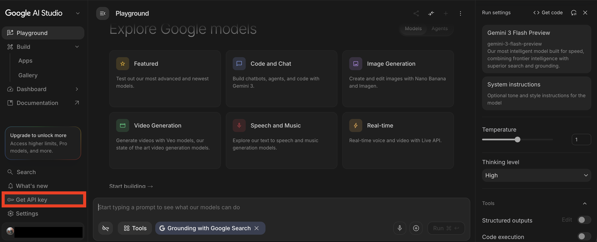
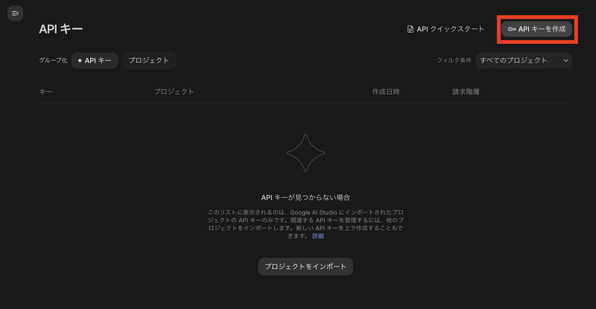
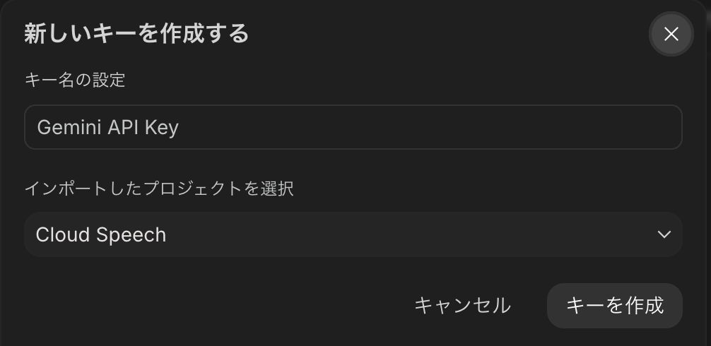
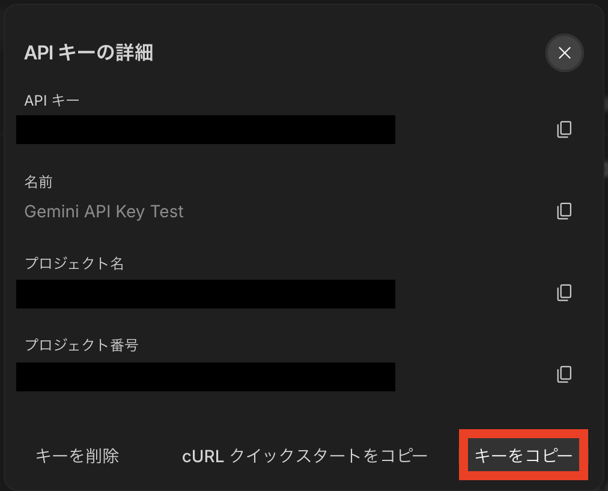

**3. `.env` に貼り付ける**

```env
AI_PROVIDER=gemini
GOOGLE_API_KEY=AIzaSy...（コピーしたキーを貼り付け）
GEMINI_MODEL=gemini-2.0-flash
```

> **無料枠の制限:**
> - 1,500 リクエスト/日・30 リクエスト/分
> - 単語 1 件の生成 = 1 リクエスト なので、個人利用では十分な容量です

---

### インストール手順

```bash
# 1. 依存関係をインストール
uv sync

# 2. 環境変数ファイルを作成
cp .env.example .env

# 3. .env を編集して使用する AI プロバイダーと API キーを設定
```

### AI プロバイダーの設定（`.env`）

**Gemini を使う場合（推奨・無料）:**

```env
AI_PROVIDER=gemini
GOOGLE_API_KEY=your_google_api_key_here
GEMINI_MODEL=gemini-2.0-flash
```

**Claude を使う場合:**

```env
AI_PROVIDER=claude
ANTHROPIC_API_KEY=your_anthropic_api_key_here
```

### アプリを起動する

```bash
uv run uvicorn language_learn.main:app --reload
```

ブラウザで **http://localhost:8000** を開いてください。

---

## 1. ダッシュボード

**URL: `http://localhost:8000/`**

アプリ起動後に表示されるトップページです。学習状況の概要を一目で確認できます。


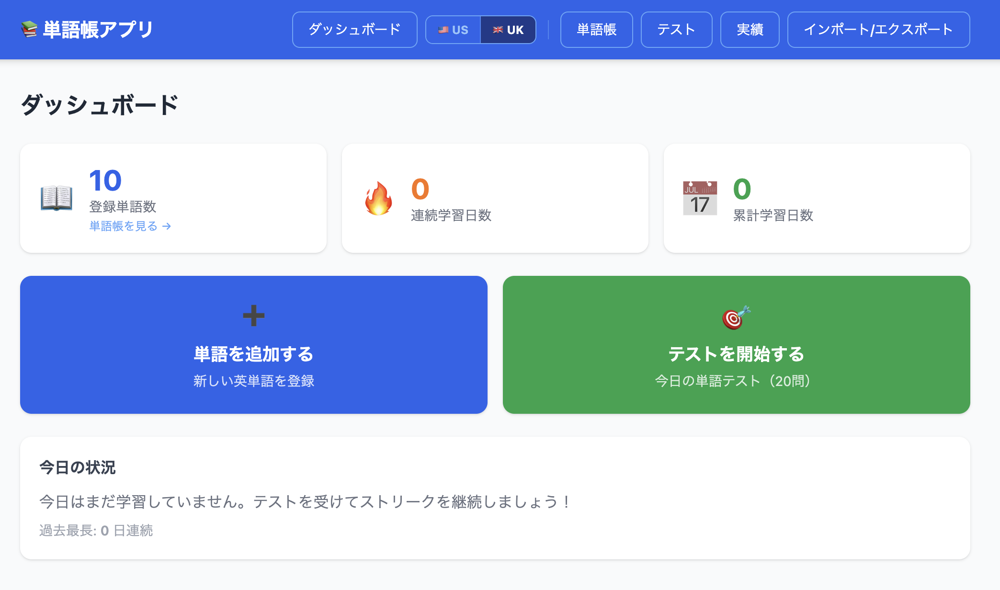

**表示される情報：**

| カード | 内容 |
|--------|------|
| 📖 登録単語数 | データベースに登録されている単語の総数 |
| 🔥 連続学習日数 | 今日まで何日連続でテストを受けたか |
| 📅 累計学習日数 | これまでにテストを受けた日数の合計 |

---

## 2. 単語を追加する

**URL: `http://localhost:8000/words/add`**

英単語を入力して「AI で生成」ボタンを押すと、Claude が自動的に情報を埋めてくれます。

### Step 1 — 英単語を入力して生成ボタンを押す


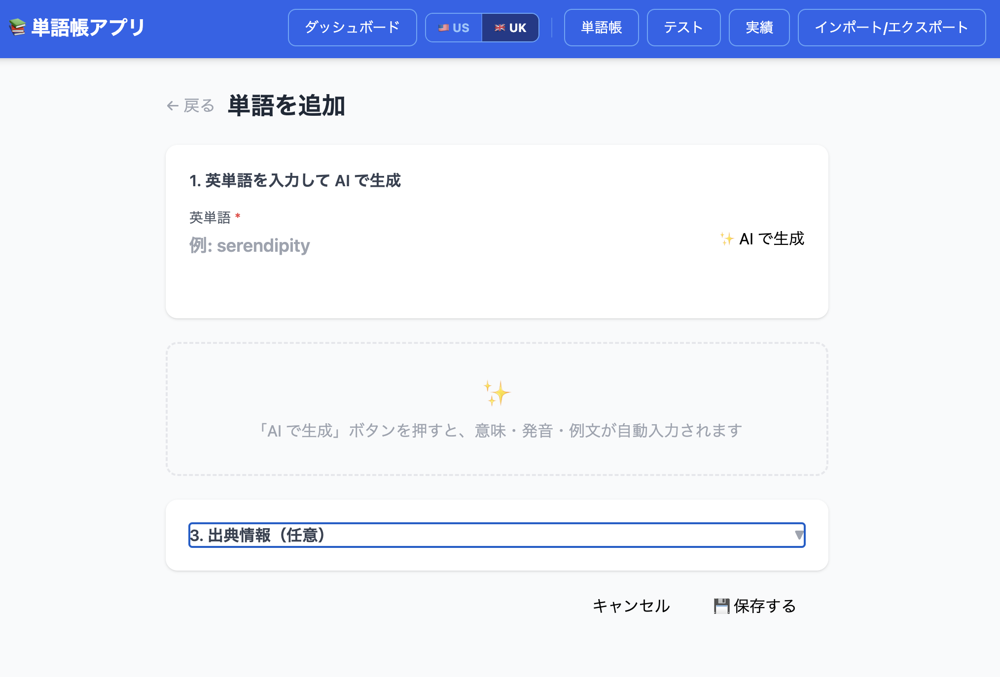

### Step 2 — 生成された情報を確認・編集する

AI が以下の情報を自動入力します。内容はすべて編集できます。


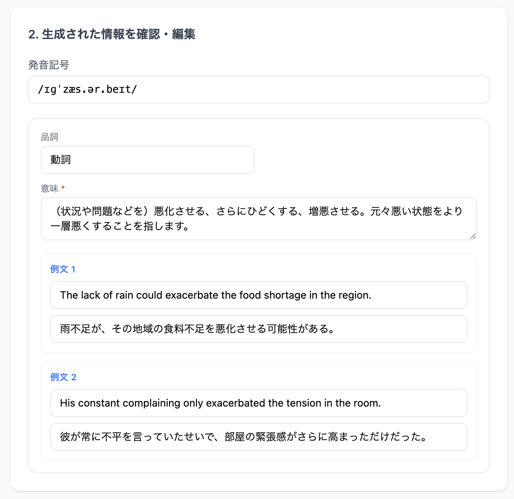

### Step 3 — 出典情報を入力する（任意）

「3. 出典情報」セクションを展開すると、この単語をどこで見かけたかを記録できます。


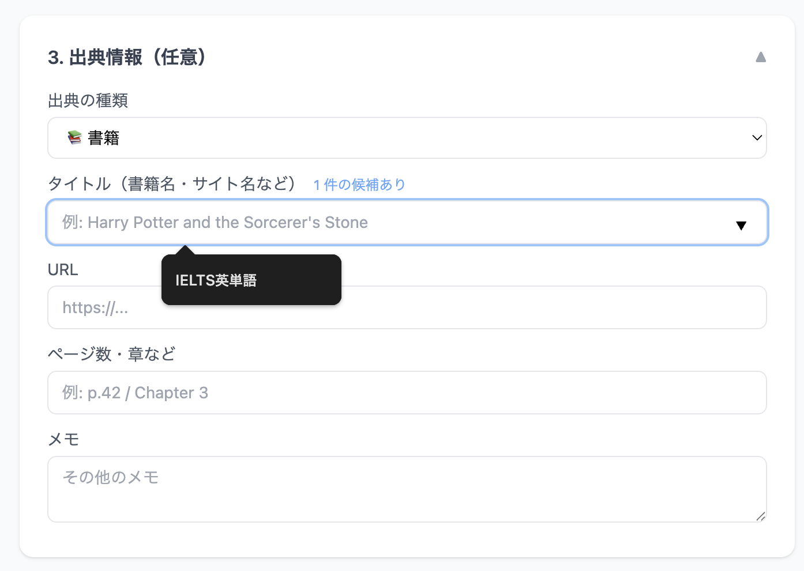

**対応している出典の種類：**

| 種類 | 用途 |
|------|------|
| 📚 書籍 | 参考書・小説・教材など |
| 🌐 ウェブサイト | ニュースサイト・ブログなど |
| 🎬 動画 | YouTube・映画・ドラマなど |
| 📌 その他 | 会話・ポッドキャストなど |

### 重複チェック

同じ単語（大文字小文字を区別しない）を登録しようとすると、エラーが表示されます。

```
┌──────────────────────────────────────────────────────────┐
│  ⚠️ 単語「Serendipity」はすでに登録されています。          │
└──────────────────────────────────────────────────────────┘
```

---

## 3. 単語帳を見る

**URL: `http://localhost:8000/words`**

登録した単語の一覧を確認・管理できます。


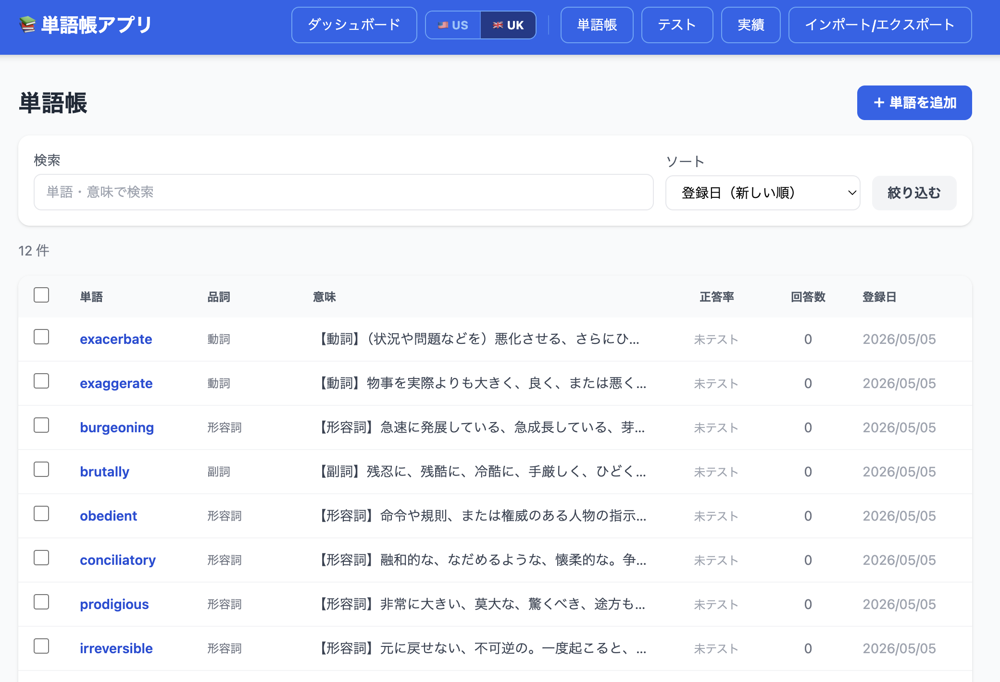

**ソートの種類：**

| ソート条件 | 説明 |
|-----------|------|
| 登録日（新しい順） | 最近追加した単語が上に来る（デフォルト） |
| 登録日（古い順） | 最初に追加した単語が上に来る |
| アルファベット（A→Z） | 単語をアルファベット昇順に並べる |
| アルファベット（Z→A） | 単語をアルファベット降順に並べる |
| 正答率（低い順） | 苦手な単語を上に表示する |

**正答率の色分け：**

| 色 | 正答率 | 意味 |
|----|--------|------|
| 🟢 緑 | 80% 以上 | よく覚えている |
| 🟡 黄 | 50〜79% | もう少し練習が必要 |
| 🔴 赤 | 49% 以下 | 重点的に復習が必要 |
| グレー | — | まだテストを受けていない |

### 単語の詳細ページ

単語の行をクリックすると詳細ページに移動します。

このページでは意味や例文の確認だけではなく、単語や単語を使った例文の発音も確認できます。


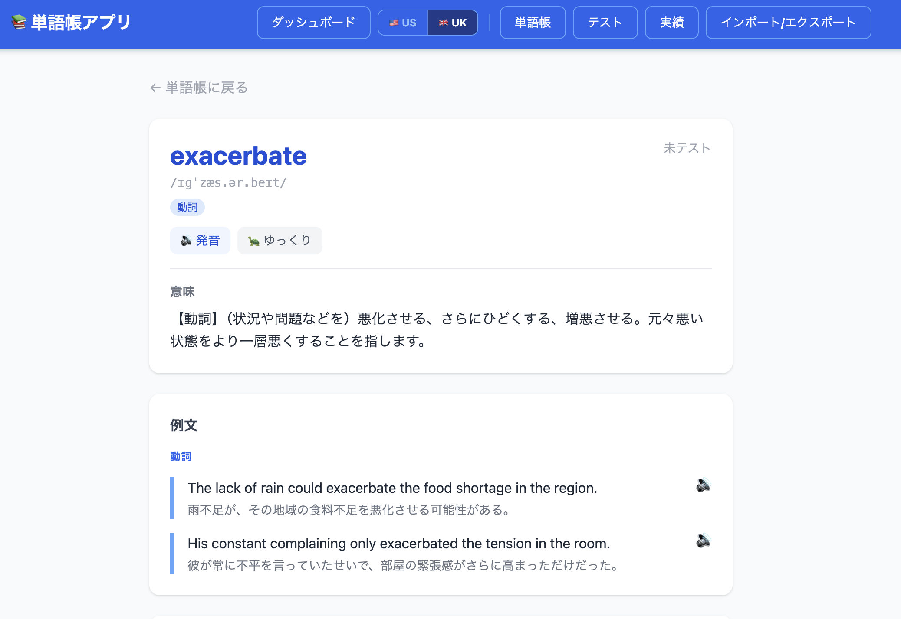

---

## 4. 単語テストを受ける

**URL: `http://localhost:8000/quiz`**

毎日の復習テストです。苦手な単語・未テストの単語を優先して出題します。

### テスト開始画面


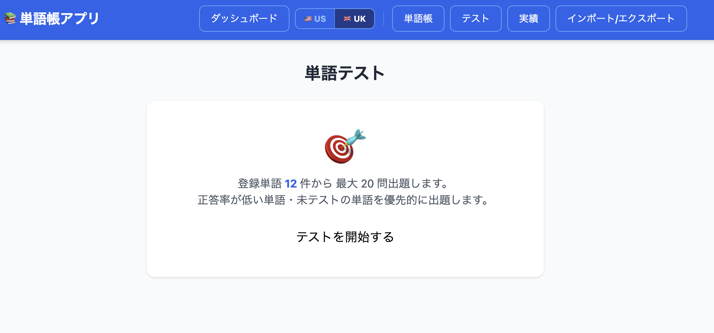

### 問題画面（Step 1: 単語を見て考える）

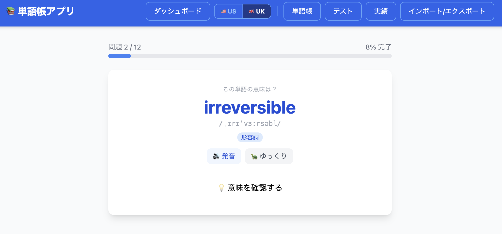

### 問題画面（Step 2: 意味を確認して回答する）

「意味を確認する」を押すと意味と例文が表示されます。  
覚えていたかどうかを **自己申告** してください。


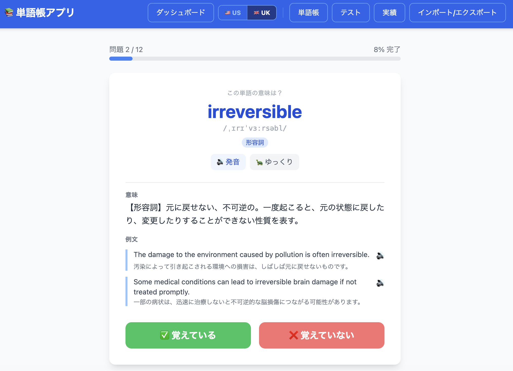

### 結果画面

20問回答し終わると結果が表示されます。

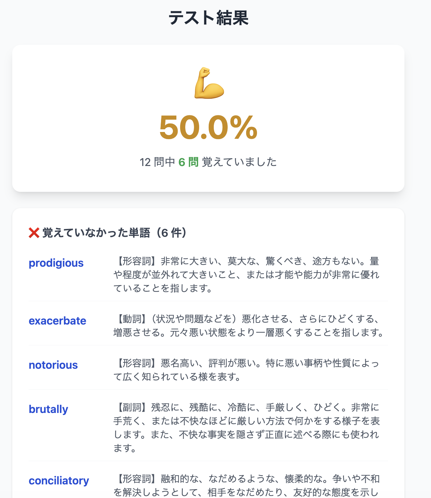

**出題の優先順位：**

```
優先度 高
  ↑    1. 一度もテストしていない単語（ランダム順）
  │    2. 正答率が低い単語（低い順）
  ↓    3. それ以外の単語（ランダム順）
優先度 低
```

テスト完了後、その日の学習記録が自動的に保存され、ストリークが更新されます。

---

## 5. 実績を確認する

**URL: `http://localhost:8000/streak`**

連続学習日数と過去の学習履歴をカレンダーで確認できます。


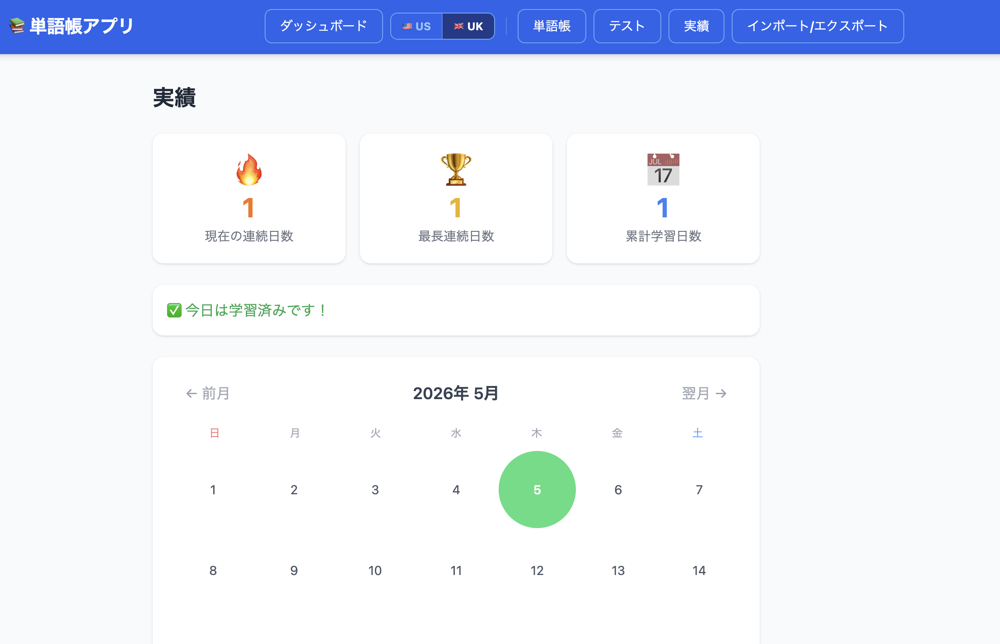

**ストリーク（連続学習日数）の仕組み：**

- テストを1回以上完了した日が「学習済み」としてカウントされます
- 連続する日が途切れるとストリークはリセットされます
- 昨日まで連続していれば、今日テストを受けるとストリークが継続します

---

## 6. エクスポート／インポート

**URL: `http://localhost:8000/export`**

単語帳データのバックアップや、別の端末への移行ができます。


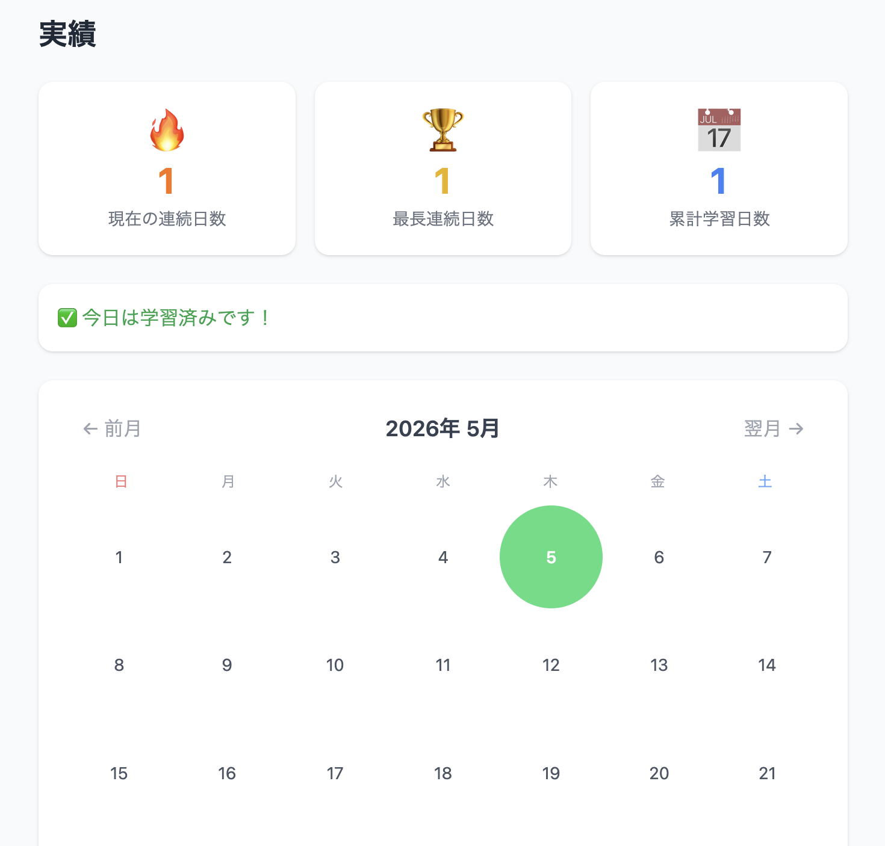

### エクスポート形式の違い

**JSON 形式（完全バックアップ推奨）**

```json
{
  "version": "1.0",
  "exported_at": "2025-05-03T10:00:00+00:00",
  "words": [
    {
      "word": "serendipity",
      "reading": "/ˌserənˈdɪpɪti/",
      "meaning": "偶然の幸運な発見",
      "part_of_speech": "名詞",
      "example_sentences": [
        { "sentence_en": "...", "sentence_ja": "..." },
        { "sentence_en": "...", "sentence_ja": "..." }
      ],
      "sources": [{ "source_type": "website", "title": "...", "url": "..." }]
    }
  ]
}
```

**CSV 形式（Excel での確認・編集向け）**

| word | reading | meaning | part_of_speech | example_en_1 | example_ja_1 | ... |
|------|---------|---------|----------------|--------------|--------------|-----|
| serendipity | /ˌserənˈdɪpɪti/ | 偶然の幸運 | 名詞 | Finding that café... | そのカフェを... | ... |

### インポート結果の例

```
┌──────────────────────────────────────────────────────────┐
│  ✅ インポート完了                                         │
│                                                          │
│  新規インポート:  38 件                                    │
│  重複スキップ:    4 件                                     │
└──────────────────────────────────────────────────────────┘
```

---


## ディレクトリ構成

```
language_learn_app/
├── src/language_learn/
│   ├── main.py                  # FastAPI アプリ起動エントリーポイント
│   ├── config.py                # アプリ設定（環境変数管理）
│   ├── core/                    # 共通基盤
│   │   ├── database.py          # DB 接続・セッション管理
│   │   ├── base_model.py        # SQLAlchemy DeclarativeBase
│   │   └── exceptions.py        # カスタム例外クラス
│   └── features/                # 機能別モジュール
│       ├── words/               # 単語帳（モデル・CRUD・ルーター）
│       ├── ai/                  # AI 連携（Claude / Gemini 切り替え対応）
│       │   └── providers/       # プロバイダー実装（base / claude / gemini）
│       ├── quiz/                # テスト（出題・回答・集計）
│       ├── streak/              # 連続学習記録・カレンダー
│       └── export/              # JSON/CSV エクスポート・インポート
├── templates/                   # Jinja2 HTML テンプレート
│   ├── base.html                # 共通レイアウト（ナビゲーション）
│   ├── index.html               # ダッシュボード
│   ├── words/                   # 単語帳関連テンプレート
│   ├── quiz/                    # テスト関連テンプレート
│   ├── streak/                  # 実績カレンダーテンプレート
│   └── export/                  # エクスポート画面テンプレート
├── static/                      # 静的ファイル
│   ├── css/app.css              # カスタムスタイル
│   └── js/app.js                # HTMX フック・UI ユーティリティ
├── data/                        # SQLite データベース（.gitignore 対象）
├── docs/
│   └── screenshots/             # README 用スクリーンショット置き場
├── .env.example                 # 環境変数テンプレート
├── pyproject.toml               # プロジェクト設定・依存関係
└── uv.lock                      # 依存関係ロックファイル
```

---

## 技術スタック

| 項目 | 技術 | 採用理由 |
|------|------|---------|
| バックエンド | FastAPI + Jinja2 | 型安全・高速・SSR に適している |
| フロントエンド | HTMX + Alpine.js | JS フレームワーク不要でリッチな UI |
| スタイリング | Tailwind CSS (CDN) | 素早くきれいな UI 構築 |
| データベース | SQLite + SQLAlchemy 2.x | ローカル動作・ファイル単体管理 |
| AI | Claude / Gemini（切り替え可能） | `.env` の `AI_PROVIDER` で設定。Gemini は無料枠あり |
| パッケージ管理 | uv | 高速・再現性の高い依存管理 |
